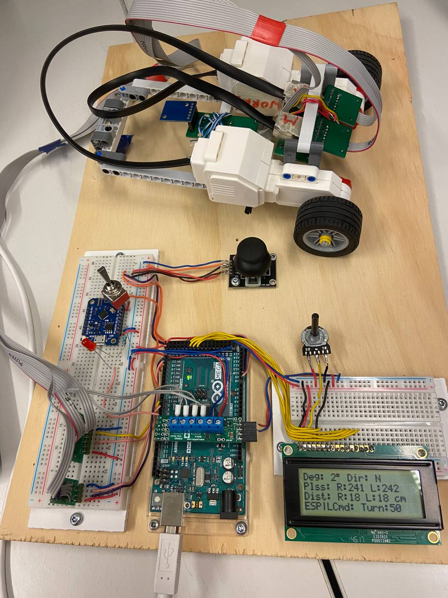

# Embedded projects 1 course
## Overview
This repository contains **final project** in `/final_demo` directory for the Embedded projects course, showcasing all key topics covered. It includes motor control, joystick navigation, compass-based adjustment, LCD feedback, a watchdog timer, and ESP8266 integration for web-based control.
### Key Features
#### Arduino Mega Code

- **Joystick Control**: Adjust speed and direction using an analog joystick.
- **Compass Module**: Ensures precise directional feedback.
- **LCD Feedback**: Displays real-time status updates.
- **Watchdog Timer**: Monitors and maintains system health.

#### ESP8266 Web Control
- **Heartbeat**: Sends real-time system status.
- **Web Interface**: Remotely control the system via a responsive webpage.

### Topics Covered
- **Motor Control**: Using PWM for speed adjustment.
- **Sensor Integration**: Joystick and compass module.
- **LCD Communication**: I2C interface for feedback.
- **Interrupts**: Handling inputs efficiently.
- **Networking**: ESP8266 for IoT control.
- **Watchdog Timers**: Ensuring reliable system operation..

### Images

